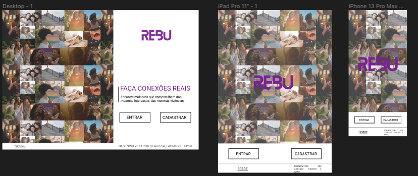
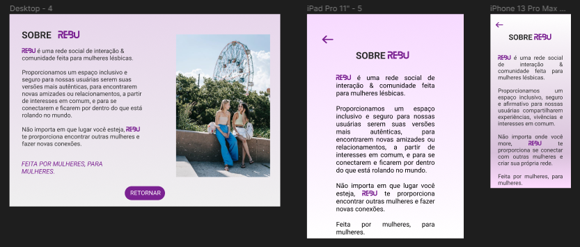
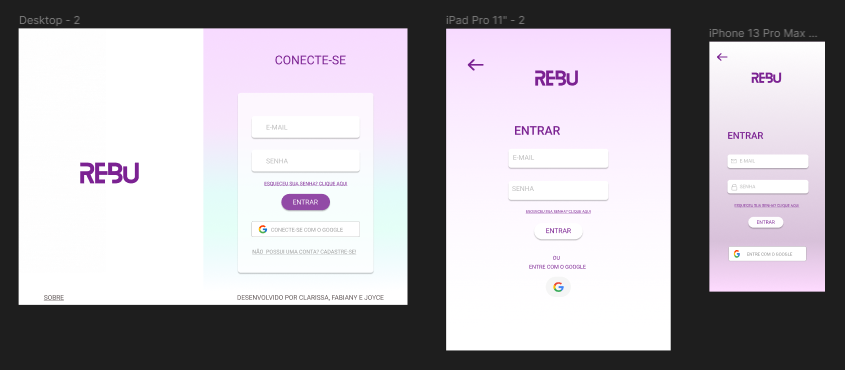
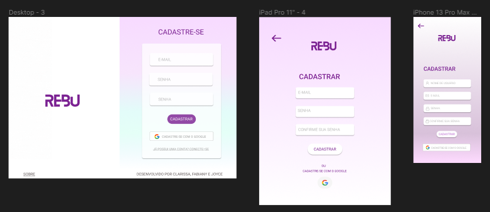
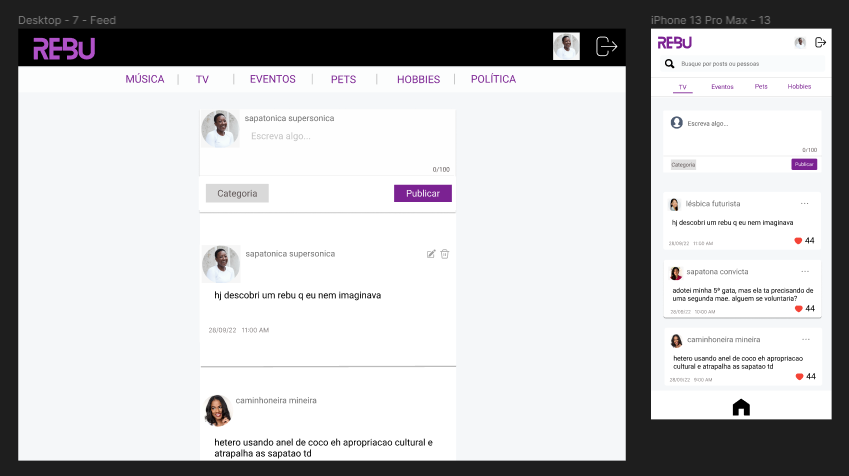
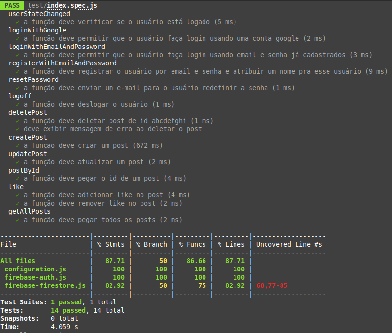

# Rede social feita por mulheres, para mulheres.

## Índice

* [1. Resumo do Projeto](#1-resumo-do-projeto)
* [2. Definição do produto e escolha do tema](#2-definição-do-produto-e-escolha-do-tema)
* [3. Pesquisa de Usuário e Histórias de Usuários](#3-pesquisa-de-usuário-e-histórias-de-usuários)
* [4. Prototipação e testes de usabilidade](#4-prototipação-e-testes-de-usabilidade)
* [5. Testes unitários e Testes assíncronos](#5-testes-unitários-e-testes-assíncronos
* [6. Ferramentas e Tech Skills](#6-ferramentas-e-tech-skills)

***

## 1. Resumo do Projeto

Social Network foi o terceiro projeto desenvolvido durante o bootcamp da turma SAP008 da Laboratória, no qual tivemos como principal objetivo a criação de uma rede social, devendo ser uma Single Page Application, através da qual fosse possível que os usuários se cadastrassem; fizessem  login; publicassem, editassem, deletassem e dessem likes em posts. 

O projeto foi desenvolvido em trio, por Clarissa, Fabiany e Joyce, dentro de 6 sprints. E as principais ferramentas utilizadas durante o processo foram: Notion, para o planning das sprints; Figma, para o processo de prototipação de alta fidelidade; Metroretro para as sessões de retrospectiva das sprints; Miro, para a escrita das histórias de usuários; Canva, para elementos de identidade visual (logo e mosaico de vídeos). 

Além disso, utilizamos o conjunto de serviços de hospedagem Firebase. Para manipularmos a parte de backend da aplicação, utilizamos os serviços Firebase Authentication - para fazer o processo de autenticação de usuários, e o Cloud Firestore - para a criação e manutenção do nosso banco de dados. 

Nossas sprints foram planejadas conforme as necessidades apresentadas em nossas histórias de usuário - as quais foram criadas com base na nossa pesquisa de usuário. Deste modo, definimos e trabalhamos no desenvolvimento das funcionalidades de nossa aplicação com base nas necessidades das usuárias. 

## 2. Definição do produto e escolha do tema

Sabemos que, infelizmente, mulheres são expostas, cotidianamente, a situações de discriminação, exclusão e abuso resultantes de uma sociedade misógina e intolerante. 
Para mulheres lésbicas, essas situações têm ainda o agravante da intersecção entre misoginia e homofobia - a lesbofobia. Segundo pesquisa realizada e publicada pelo Lesbocenso Nacional (2021-2022), https://lesbocenso.com.br/ 78,6% das entrevistadas já sofreu lesbofobia, e 77,3% conhece alguma mulher lésbica que já foi vítima. 

Sendo assim, vimos, na criação deste projeto, uma oportunidade para criar uma iniciativa que propõe solucionar o problema que é a escassez por espaços inclusivos e feitos exclusivamente para mulheres lésbicas, objetivando proporcionar a elas uma experiência online livre das diversas formas de preconceito que sofrem enquanto mulheres, casais e grupo social, cotidianamente. 

Fundamentando-nos em conceitos de UX, realizamos uma pesquisa de usuário com 20 mulheres lésbicas, através da qual buscamos entender se seria do interesse destas mulheres uma rede social exclusivamente feita para o uso desse público, e se elas já haviam utilizado uma rede social como a que propomos. Conforme os resultados obtidos, 100% das usuárias aprovaram a proposta. A partir da apuração dos resultados, e considerando a problemática em questão, definimos nosso produto da seguinte forma: 

Rebu é uma rede social destinada a mulheres lésbicas, possibilitando que elas compartilhem experiências, vivências e interesses,  para se conectarem e formar novos laços.  

Rebu surgiu como uma forma criativa e tecnológica de solucionar o problema que é a escassez por espaços inclusivos que sejam feitos e pensados exclusivamente para mulheres lésbicas. O intuito por trás da criação deste projeto é disponibilizar um espaço online, seguro, acolhedor e afirmativo para essas mulheres se conectarem e interagirem.
 

## 3. Pesquisa de Usuário e Histórias de Usuários

Nossa pesquisa de usuário se deu através da aplicação de um questionário para um grupo de 20 mulheres lésbicas. Buscamos entender a viabilidade da nossa proposta para nosso público; com quais termos elas se sentiam confortáveis; e quais funcionalidades elas julgavam ser importantes em uma rede social deste tipo. Os resultados obtidos inspiraram a criação de nossas histórias de usuários.

Durante nossas sprints, trabalhamos uma história de usuário por vez, desenvolvendo, implementando e testando as funcionalidades criadas para solucionar os problemas de cada história. Chegamos ao resultado de 4 diferentes histórias de usuários, como observadas a seguir:

### HISTÓRIA 1: 
Para a conclusão desta história, focamos em implementar as páginas de cadastro e login da página, e criar a lógica de cadastrar e logar com e-mail ou com gmail utilizando o Firebase como autenticador. 
 
### HISTÓRIA 2: 
Para atender à segunda história, criamos uma página de redefinição de senha e a lógica para recebimento de e-mail de redefinição de senha - utilizamos o Firebase. Além disso, trabalhamos na construção da lógica para validação dos inputs dos formulários e para tratar os erros do Firebase, transformando-os em mensagens user friendly que também são exibidas na tela em formato de aviso. 

### HISTÓRIA 3: 
Conforme a demanda desta história, trabalhamos na implementação das funcionalidades de criar, editar, deletar e curtir posts.

### HISTÓRIA 4: 
Incluímos filtragem e categorização de posts, possibilitando que a usuária categorize suas próprias postagens conforme determinados interesses, além de conseguir filtrar postagens exibidas no feed conforme os dados interesses. 

* **Critérios de aceitação:** tudo o que deve acontecer para satisfazer as
  necessidades do usuário.

* **Definição de pronto:** todos os aspectos técnicos que devem ser atendidos
  para que, como equipe, saibam que essa história está finalizada e pronta para
  ser publicada. **Todas** suas histórias de usuário (com exceções), devem
  incluir esses aspectos em sua definição de pronto (além de tudo o que precisa
  adicionar):

  - Ser uma SPA.
  - Ser _responsivo_.
  - Receber _code review_ de pelo menos uma parceira de outra equipe.
  - Fazer _tests_ unitários.
  - Fazer testes manuais buscando erros e imperfeições simples.
  - Fazer testes de usabilidade e incorporar o _feedback_ dos usuários como
    melhorias.

## 4. Prototipação e testes de usabilidade

Utilizamos o Figma para o processo de prototipação, e iniciamos o processo pela metodologia de mobile first, de modo que iniciamos com a construção do protótipo na versão mobile.

Pensamos nos protótipos com base nas histórias de usuário, resultando na homepage, página de login, de registrar, sobre a rede social e de feed.
Após montarmos nossos protótipos, realizamos o teste de usabilidade a fim de oferecer a melhor experiência para a usuária. Após alguns ajustes, o protótipo foi finalizado. Nos próximos tópicos, veremos melhor como se deu os detalhes do layout.

### 4.1 Paleta de cores e fontes

A paleta de cores foi pensada para representar a comunidade lésbica desde a cor do site,, sendo a cor roxa a principal, devido a cor da bandeira do orgulho lésbico. Além disso, utilizamos a fonte Blanka para criar a logo e a fonte Roboto para utilizar na página de login e register.

Na imagem, podemos ver as cores principais utilizadas no projeto.

### 4.2 Telas

Criamos o protótipo do site para três tipos de telas diferentes: mobile, tablet e desktop.

### 4.3. Estrutura e features da aplicação

A aplicação foi dividida nas seções:

#### PÁGINA INICIAL

É a página principal do site, através da qual as usuárias iniciam navegação; podendo ser direcionadas a outras seções da aplicação (as páginas de about, login e cadastro).

#### ABOUT

Página que contextualiza a rede social, explicando sua definição e proposta.

#### LOGIN E CADASTRO

Nossas usuárias podem se cadastrar e entrar utilizando o método do google, ou com e-mail e senha. As usuárias recebem mensagens de apoio para realizar a etapa de registro e login, com validação de formulário. 

#### FEED

Na Rebu é possível publicar, categorizar, dar like, editar e deletar posts. Deste modo, na página de Feed, nossas usuárias poderão publicar posts, categorizar seus posts para serem exibidos conforme a categoria selecionada, editar e deletar os próprios posts, além de dar like em e pesquisar por posts de outras usuárias, e exibir apenas posts que correspondam a determinada categoria, através de um sistema de filtros. 

## 5. Testes unitários e Testes assíncronos

Os testes desse projeto foram desenvolvidos pra verificar a quantidade de chamada das funções do firebase e com quais parâmetros essas funções são chamadas.

Rebu foi nossa primeira experiência com mock de função. Usamos o framework Jest.

 

## 6. Ferramentas e Tech Skills

- Figma;
- Notion;
- Metroretro;
- Miro;
- Git e GitHub;
- HTML5;
- CSS;
- Javascript;
- Responsividade;
- Jest;
- Firebase.
